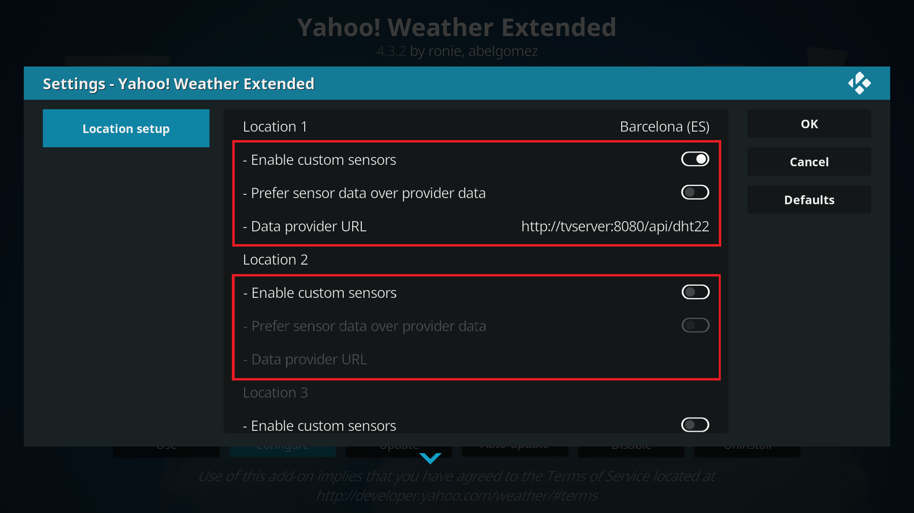
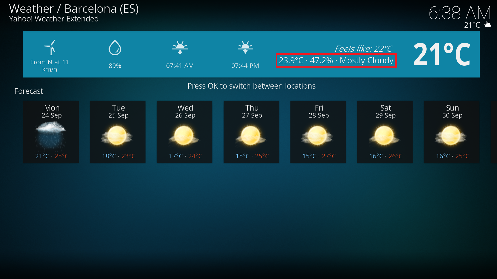

# Yahoo! Weather Extended Kodi Plug-in

This repository contains a fork of the _Yahoo! Weather_ Kodi addon available at [https://gitlab.com/ronie/weather.yahoo](https://gitlab.com/ronie/weather.yahoo).

This fork allows complementing the weather locations with extra data retrieved from custom sensors (currently, only temperature and humidity are supported).

The addon expects the data to be available via a REST service, returning a JSON conforming (at least) the following format:

```
{
  "humidity": 47.79999923706055,
  "temperature": 24.100000381469727
}
```

An example of such a service returning valid data can be found in [https://github.com/abelgomez/sensors-server](https://github.com/abelgomez/sensors-server).

Due to the limitations of the Kodi weather API (only a single numeric value is expected for the `Current.Temperature` and `Current.Humidity` properties), by default, the sensor data is prepended to the `Current.Condition` string.

If the sensor data is preferred over the weather provider data, the sensor data is specified in the main `Current.Temperature` and `Current.Humidity` properties. In that case, the `Current.Condition` contains the data from the weather provider instead.

# Screenshots




